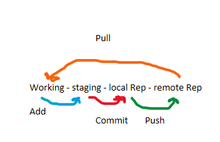

# GitExercise

| Begreb | Definition |
| ----------- | ----------- |
| add | Tilføjer ændringer til vores næste commit | 
| Commit | Savepoint | 
| Push | Opdater source | 
| Pull | Opdater lokal maskine |

Formålet med værktøjet er at forstå, hvordan større teams kan samarbejde i en fælles kodebase **uden** at forstyrre eller overskrive hinandens arbejde! 